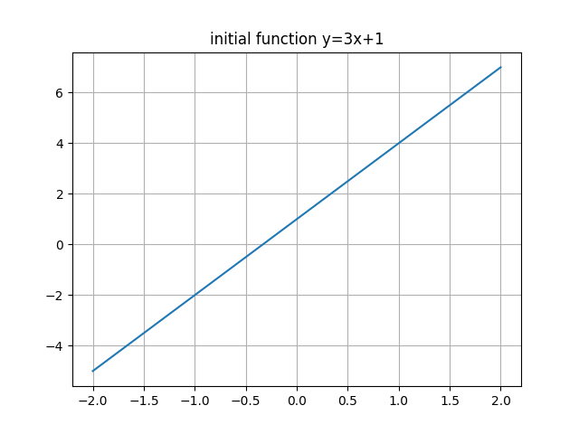
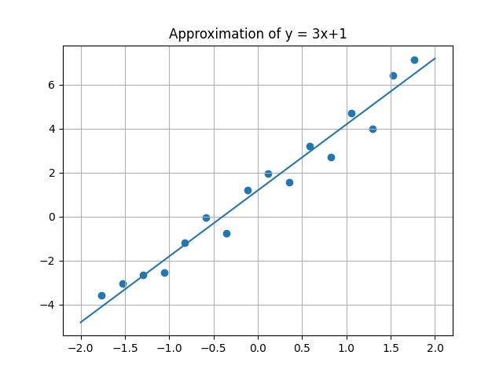

# Лабораторная работа №5
# Двумерный поиск для подбора коэффициентов простейшей нейронной сети на примере решения задачи линейной регрессии экспериментальных данных
## Вариант 1

## Задание

В зависимости от варианта работы найти линейную регрессию функции (коэффициенты наиболее подходящей прямой) по набору ее дискретных значений, заданных равномерно на интервале со случайными ошибками. Выполнить расчет параметров градиентным методом. Провести двумерный пассивный поиск оптимальных весовых коэффициентов нейронной сети (НС) регрессии.
|  c  |  d  |   a  |  b  |  N   |   A   |
|-----|-----|------|-----|------|-------|
|  3  |  1  |  -2  |  2  |  16  |  2    |

Результат работы программы представлен в скриншоте:

